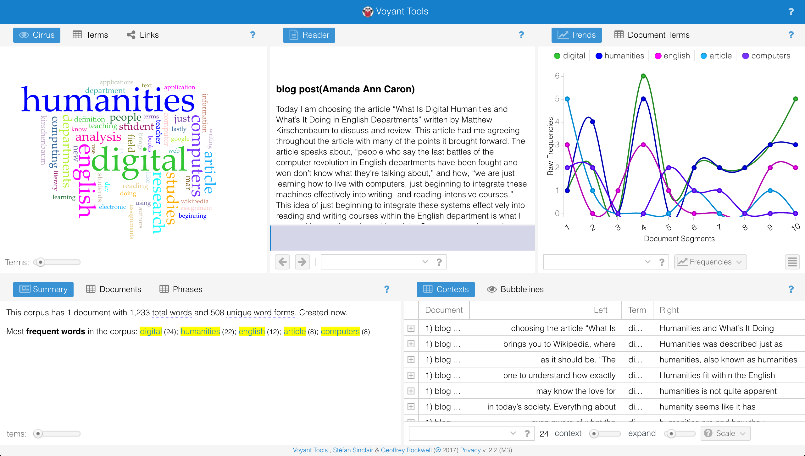

 # Digital Humanities in English Departments... I agree
 
      
   Today I am choosing the article “What Is Digital Humanities and What’s It Doing in English Departments” written by Matthew Kirschenbaum to discuss and review. This article had me agreeing throughout the article with many of the points it brought forward. This article speaks about, “people who say the last battles of the computer revolution in English departments have been fought and won don’t know what they’re talking about,” and how, “we are just learning how to live with computers, just beginning to integrate these machines effectively into writing- and reading-intensive courses.” The idea of just beginning to integrate these systems effectively into reading and writing courses within the English department is what I agree with most throughout this article. Computers are becoming more depended on as the years go by. Although some schools are replacing certain teaching aspect such as learning cursive writing with new computer applications; computers have a lot more to offer for educational and new learning purposes. Computers can help students expand their knowledge and learn more then reading from a textbook in today’s day and age.
      
   The article brings forth the fact that once you google a definition it brings you initially to Wikipedia. Wikipedia described the Digital Humanities as, “The digital humanities, also known as humanities computing, is a field of study, research, teaching, and invention concerned with the intersection of computing and the disciplines of the humanities… It involves investigation, analysis, synthesis and presentation of information in electronic form…” Even though Wikipedia is most often viewed as an unreliable source, its data is not always invalid. I would like to now draw from this definition and focus on the main terms that appear; study, research, teaching, and invention. These terms are main concepts that one would use within an English department. The teacher and the student can relate to all of these terms on different levels. A teacher studies and does research for their lesson as the student studies and does research for the curriculum, in order to do assignments and complete tests. A teacher mainly teaches, but many teachers implement students teaching chapters of certain books as well. Lastly, they are both inventors, whether it comes to the teacher inventing each assignment or each student inventing their final portfolio. Breaking down the individual statements made within this Wikipedia definition make it easy for one to understand how exactly Digital Humanities fit within the English department.

   As many of you may know the love for digital humanities is not quite apparent in today’s society. Everything about digital humanity seems like it has come about and is just “there” for most people. Many are not even aware of what the digital humanities are and how they use them on their day-to-day lives. Countless people are also unaware of how using digital humanities within the English system has many advantages and benefits. Kirschenbaum elaborates on how the digital humanities benefit English Departments by explaining that there is decades of research in fields like, “stylistics, linguistics, and author attribution studies, a great association between computers and composition…the openness of English departments to cultural studies, where computers and other objects of digital material culture become the centerpiece and analysis, and lastly the explosion of interest in e-reading and e-book devices like kindle, iPad, and nook and the advent of large-scale text digitization projects, the most significant of course being Google Books.” While technology is growing and the demand for technology grows so does their dependency for using devices within the schooling system.

   To expand on this concept that Kirschenbaum  brought forth on how the demand for technology is ever growing and how people are becoming more reliant on these tools I found some direct instances where digital humanity tools would be beneficial in English departments. One particular example that really stood out to me was the fact that we can find a definition that was previously created and reconstruct it in our own words, but to do so we use tools that the digital humanities brought forward to us. An example Kirschenbaum article shared was, “we might use a text analysis tool named Voyeur developed by Stéfan Sinclair to mine the proceedings from the annual Digital Humanities conference and develop lists of topic frequencies or collocate key terms or visualize the papers”. We can find a common ground from a definition from a digital humanities tool in order to form our own definition to and idea or concept. Or how today old texts from the past have been rewording or translated for people today to understand more clearly. To do this tools developed from the digital humanities were used. Today these tools help develop how we learn in our English departments. Students may not understand Shakespeare, but they have the accessibility to tools that can help them understand because of the digital humanities. To expand on this concept Kirschenbaum article mentions, “the Shakespeare Quartos Archive… makes a searchable digital facsimile of each of the thirty-two extant quarto copies of Hamlet available online, while Preserving Virtual Worlds, a project supported by the Library of Congress, has developed and tested standards and best practices for archiving and ensuring future access to computer games, interactive fiction, and virtual communities.” This idea of being able to preserve the past, but almost bring forward a new life form of it is what the digital humanities truly are. They are not trying to destroy what has shaped the English department today, but make advances on it. Make the resources we have available to us even more brilliant. Making hard cover textbooks from libraries available online for anyone to access so that no one is “left out” or unable to grow their English knowledge. 

  This expresses that using computer applications to your advantage can be easier and much more resourceful. With the use of computers one has an infinite amount of information and easier access to that information and resources. The article also expresses that, “digital humanities is also a social undertaking. It harbours networks of people who have been working together, sharing together, arguing, competing, and collaborating for many years”. To support this claim I pulled a quote from Chapter 4 of Hermeneuti that says, “the perceived importance of Digital Humanities has changed our sense of our community and inclusiveness”. From my own perspective digital humanities provide new ways of doing scholarship that involve collaborative, and computationally engaged research, and publishing. One of the best examples of this is the application Google Drive. This software allows you to share documents with anyone you desire, whether you share the link or the file. It brings collaboration to a new scale. Might I also add that next to research, information, and collaboration computers offer, they can provide great application for creating documents and presentations for one to thrive within their given course.

  Lastly, While attempting to find a definition of what Digital Humanities really is, I came upon these two definitions by two different authors, “an interdisciplinary field in which scholars and educators bring computational tools and methods to humanistic inquiry” (p.113, William Fenton) and, “Digital Humanities is most frequently associated with the computational analysis of text, from the Bible to modern literature.” (p.20 , Gregory Mone) This shows that even many of us today still do not fully understand the capabilities of the digital humanities. Furthermore Daniel Kim once wrote, “to date, the application of computing to literary studies has been primarily in stylometry (or stylistics) and in the structural analysis of texts. In these areas, scholars have demonstrated the value of text analysis software to studies of authors and texts. But an important figure has been left out of the field of literary computing: the reader.” This statement shows that instead of allowing “elders” or the people that are not within the English Department to determine whether or not digital humanities is beneficial because they are not the ones actually using the technology, the readers are.
Overall, Digital Humanities is closer and closer to receiving the recognition it deserves. It has been a major contribution to the future of many English departments. It has aided the studies of students as well as “graduate students, faculty members (both tenure line and contingent), and other academic professionals” says Kirschenbaum article. Hermeneuti also notes that, “Digital Humanities seems to have gone from a marginal field trying to gain respect to the favourite of university administrators.” As a student and almost a graduate student I one hundred percent know that I will always be relying on my digital resources when not only completing any English assignments in the future, but mainly any assignment.

Fenton, William. "Digital Humanities: The Most Exciting Field You've Never Heard of." PC Magazine, Mar. 2017, pp. 113-120.

Kim, Daniel. "Finding the Reader in Literary Computing [1998, rptd. 2008]." Digital Studies / Le champ numérique[Online], 0.0.06 (1998):     n. pag. Web. 10 Mar. 2017 

Kirschenbaum, Matthew. "What Is Digital Humanities and What's It Doing in English Departments?" Dhdebates (2012): n. pag. Web. 10 Mar.       2017.

Mone, Gregory. “Whats Next for Digital Humanities?” Communications of the ACM, vol.59, no.9, June 2016,pp.20-21.
 
“The Swallow Flies Swiftly Through: An Analysis of Humanist | Hermeneuti.ca.” N.p. Web. 10 Mar. 2017.

[Voyant Link Here!]( https://voyant-tools.org/?corpus=f83cb35ef6a255f548365c65b85ad5e1)
